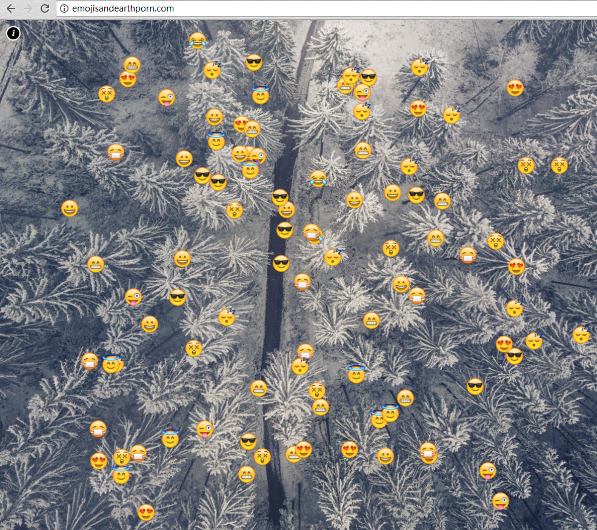
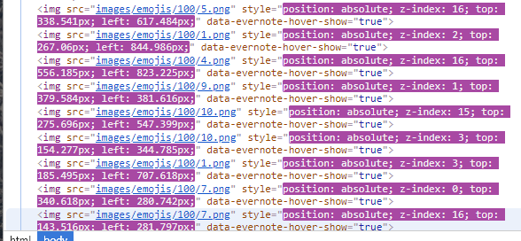
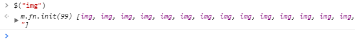
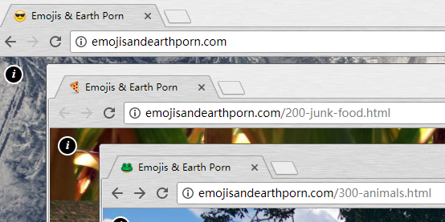
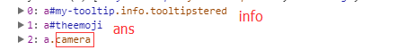

### emojisandearthporn.com

**Author: Double Dark of Sakura**

#### Introduce

> This is an online game.
> 这是一个在线游戏。
> 
> The purpose of the game is to find the still motionless Emoji.
> 游戏的目的是找出静止不动的表情。



#### Solving Steps

First,

There many `` labels.



```javascript
$.each($("img"), (k, v) => {
	var temp = $(v)[0]
	var t = temp.style.cssText
	setTimeout(function() {
		// console.log(t, "\n" ,temp.style.cssText)
		if (t === temp.style.cssText) {
			console.log(v)
		}
	}, 1000)
})
```

But...

It doesn't work!

And then, I count the number of `` labels.



However, I guess there are 100 Emoji in the first step.



So, I am sure that the Emoji which I want to find is not a `` label.

Finally, I find 3 `<a>` labels which have image.



#### Full Code & Answer

```javascript
$("a")[1].click("return false")
```

There are ten steps in total.

List:

+ [1 Step](http://emojisandearthporn.com/)
+ [10 Step](http://emojisandearthporn.com/1000-poo.html)
+ [winner](http://emojisandearthporn.com/winner.html)
